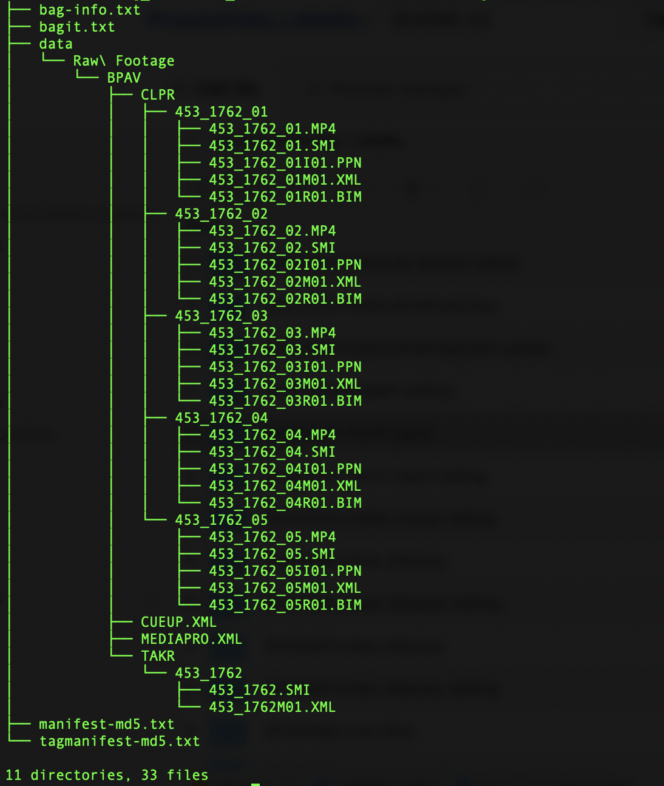
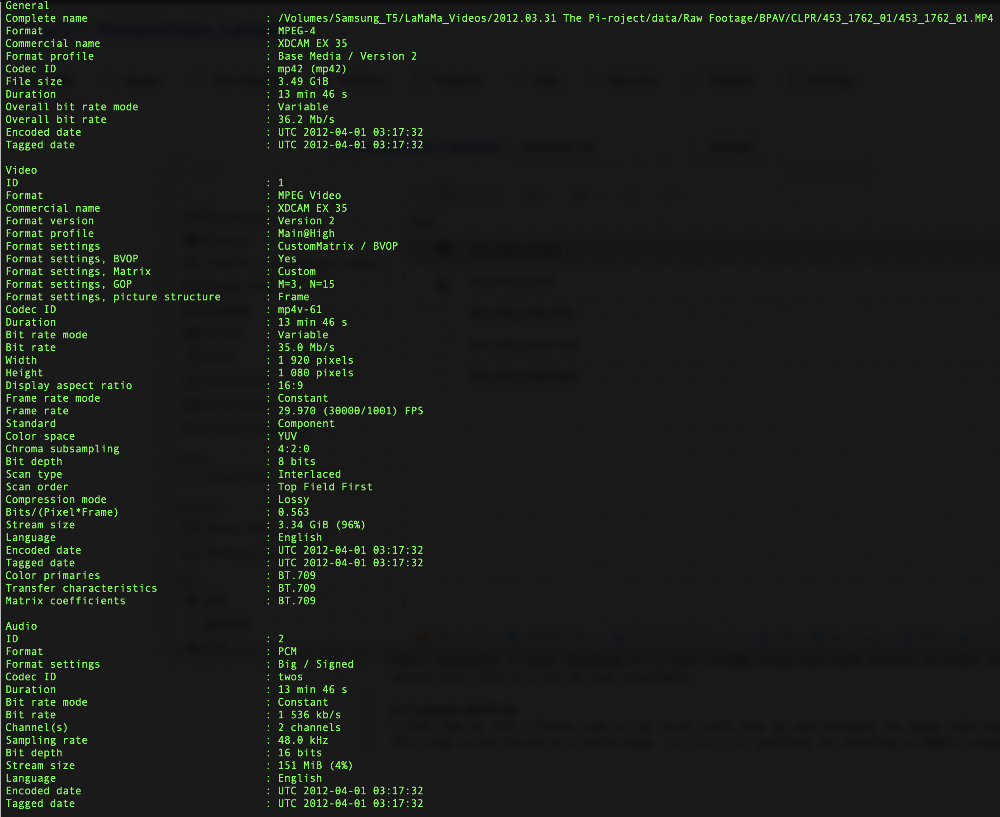

# ProcessVideo_LaMaMa
The following script serves as a `microservice` for processing video files at the La MaMa Experimental Theatre Club Archive.  

# Background
In fall 2020, I had my internship at the La MaMa Experimental Theatre Club Archive. My job responsibilities included: make preservation master files (bitrate = 15Mb/s) and access files (bitrate = 5Mb/s, with fade-in and fade-out effect) out of video recordings of each staged performance (the video recordings were derived from Sony digital cameras); and catalogue each video recording of performance, each performance production, and each performance word (a cataloguing hierarchy designed according to the FRBR model).  
Because digital cameras store video files and their accompanying metadata files according to a specific fild folder arrangement, to view and retrieve each video file, users need to go over a number of file folder layers, a process that causes time and labor. Usually, capturing one stage performance will generate more than one video file. In this case, if a user intends to view a full record of the stage show, he/she will need to repeat the above procedure multiple times in order to retrieve every single video file that records different segments of the stage show.   
The file folder arrange of SONY digitla camera (the model La MaMa uses is PMW-EX3) as as below:  
 
 

Each born-digital camera originated video file carries the below technical characteristics (reading from MediaInfo):  
 

# Traditional Workflow
The traditional workflow of making preservation master files and access files is:  
For every large folder that represents one stage show: `extract every video file from the nested folder structure` -> `concatenate video files in a correct order in Adobe Premiere` -> `render into required preservation master format in Media Encoder` -> `add fade-in fade-out effects in Adobe Premiere` -> `render into required access copy format in Media Encoder`.  
Setting aside the time taken to repetatively extract video files, rendering video files in a software like Adobe Premiere (with graphic user interface) takes many hours. Averagely, a video recording of a 1-hour La MaMa stage show takes 8 hours to render into a preservation master file and another 4 hours to render into an access file. This is a lot of time investment.  

# Proposed Workflow
I then came up with a Python code script which could help me semi-automate the above laborious process.  
This code script served as a tailor-made `microservice` workflow for handling La MaMa's video files derived from their SONY digital camera.  

## Gear Up!
Follow [this guideline](https://amiaopensource.github.io/av-python-carpentry/setup.html) to install Anaconda which allows you to run Python codes one stop.
You will also need FFmpeg - a savior to handle audiovisual materials with ease and speed. The simplest way to [install FFmpeg](https://github.com/fluent-ffmpeg/node-fluent-ffmpeg/wiki/Installing-ffmpeg-on-Mac-OS-X) is through homebrew.
